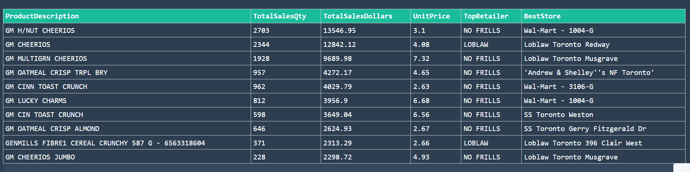

# 📊 Sales Analytics Dashboard

This is a **Sales Analytics Dashboard** built using **Plotly Dash** to visualize product sales across different cities in Canada. It enables users to explore data interactively via dropdowns, graphs, and tables.

The Dashboard is an interactive web application designed to visualize and explore retail sales data across different Canadian cities. Built using Dash, Plotly, and Bootstrap, this dashboard enables users to filter data by city, product, category, and month, providing dynamic insights through graphs, maps, and tables. The app displays key performance indicators such as total sales, product-wise distribution, and top-performing retailers, allowing businesses and analysts to make data-driven decisions. With a modern dark-themed UI and seamless interactivity, this tool brings together the power of data analytics and intuitive design to uncover sales trends, regional demand, and product performance in real-time. It serves as a valuable asset for retail businesses aiming to understand customer behavior and optimize inventory, marketing, and operational strategies.

 

## 🚀 Features

- Dark themed UI using `Dash Bootstrap Components (DARKLY theme)`
- Filter sales data by:
  - City
  - Product
  - Category
  - Month
- Interactive visualizations:
  - Top Products in City
  - Top Categories in City
  - Top Retailers by Sales
  - Postal Code level comparison
  - Sales Distribution Map
- Summary text and total sales information
- Dynamic product distribution table

## 🛠️ Tech Stack

- **Python**
- **Dash & Plotly**
- **Dash Bootstrap Components**
- **Pandas**
- **Custom Data Analysis Functions** (e.g. `TopProductCitySalesDollars`, `TotalCategoryCitySales`, etc.)

## 📂 Folder Structure

```
project/
├── app.py
├── data/
│   └── sales_data.csv
├── assets/
│   └── Example-Images
├── functions/
│   ├── charts.py
│   ├── maps.py
│   └── tables.py
├── README.md
```

## ▶️ How to Run

1. Clone the repository:
```bash
git clone https://github.com/your-username/sales-dashboard.git
```

2. Install dependencies:
```bash
pip install -r requirements.txt
```

3. Run the app:
```bash
python app.py
```

4. Visit [http://localhost:5000](http://localhost:5000) in your browser.

## 📊 Example Visuals

- Top Product Sales in a Selected City, Category and Fiscal Month

 

- Geographical Map Visualization of Retailers and Postal Code performance for selling the selected product (strong vs weak)


- Category-wise Summary Stats




## 📦 Requirements

Include the following in `requirements.txt`:
```
dash
dash-bootstrap-components
pandas
plotly
```

## 📃 License

This project is open-source and available under the [MIT License](LICENSE).

---

Built with ❤️ using [Dash](https://dash.plotly.com/)
